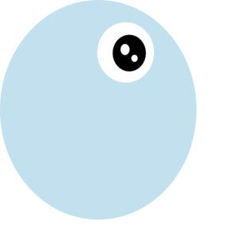

# Pacman-Exercise
## Description
### If you've ever played an arcade game, then you're familiar with Pac-Man!
We are not building the full PacMan game in this activity. However, we will be building a feature of this game, which displays and moves PacMan from one side of the screen to the other. 

 

## Steps to Run
Ensure you have the following files downloaded from this repository onto your local machine and saved into the same file directory.
<ul>
  <li>index.html</li>
  <li>pacman.js</li>
  <li>images</li><i>(along with all the photos in this folder)</i>
</ul>
Drag and drop the index.html into your web browser

<i>You may also use this link to preview this repository</i> &middot; <a href="https://jenniferwtam.github.io/Pacman-Exercise/
" target="__blank">Pacman-Exercise</a>

## Future Improvements
I would like be able to add a yellow circle in front of Pacman's mouth to emulate the original Pacman games a little more.

## License Information
MIT License

Copyright (c) 2021 John Williams

Permission is hereby granted, free of charge, to any person obtaining a copy
of this software and associated documentation files (the "Software"), to deal
in the Software without restriction, including without limitation the rights
to use, copy, modify, merge, publish, distribute, sublicense, and/or sell
copies of the Software, and to permit persons to whom the Software is
furnished to do so, subject to the following conditions:

The above copyright notice and this permission notice shall be included in all
copies or substantial portions of the Software.

THE SOFTWARE IS PROVIDED "AS IS", WITHOUT WARRANTY OF ANY KIND, EXPRESS OR
IMPLIED, INCLUDING BUT NOT LIMITED TO THE WARRANTIES OF MERCHANTABILITY,
FITNESS FOR A PARTICULAR PURPOSE AND NONINFRINGEMENT. IN NO EVENT SHALL THE
AUTHORS OR COPYRIGHT HOLDERS BE LIABLE FOR ANY CLAIM, DAMAGES OR OTHER
LIABILITY, WHETHER IN AN ACTION OF CONTRACT, TORT OR OTHERWISE, ARISING FROM,
OUT OF OR IN CONNECTION WITH THE SOFTWARE OR THE USE OR OTHER DEALINGS IN THE
SOFTWARE.
